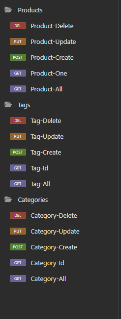
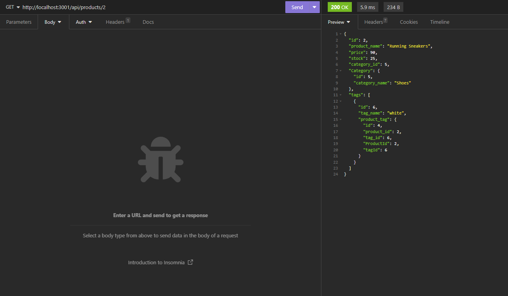

# ORM_E-COMMERCE_SHOPPING

## Description
In this project I have been given starter code to then create a shopping database with categories, tags and products for users to
have access to assets that have been placed inside the database. With the help of the mini project we did I was able to complete
complete this project without too much trouble.

## Table of Contents
* [User Story](#user-story)

* [Acceptance Criteria](#acceptance-criteria)

* [Installation](#installation)

* [Images](#images)

* [Links](#links)

## User Story

```md
AS A manager at an internet retail company
I WANT a back end for my e-commerce website that uses the latest technologies
SO THAT my company can compete with other e-commerce companies
```

## Acceptance Criteria

```md
GIVEN a functional Express.js API
WHEN I add my database name, MySQL username, and MySQL password to an environment variable file
THEN I am able to connect to a database using Sequelize
WHEN I enter schema and seed commands
THEN a development database is created and is seeded with test data
WHEN I enter the command to invoke the application
THEN my server is started and the Sequelize models are synced to the MySQL database
WHEN I open API GET routes in Insomnia for categories, products, or tags
THEN the data for each of these routes is displayed in a formatted JSON
WHEN I test API POST, PUT, and DELETE routes in Insomnia
THEN I am able to successfully create, update, and delete data in my database
```

## Installation
npm i mysql2
npm i sequelize
npm run seed

## Images



An MP4 video that shows how the coding works through insomnia and it has been placed in the Assets folder

## Links
Github: [Link text](https://github.com/Christopher-VA)
Email: [link text](cvonaltenstadt@gmail.com)